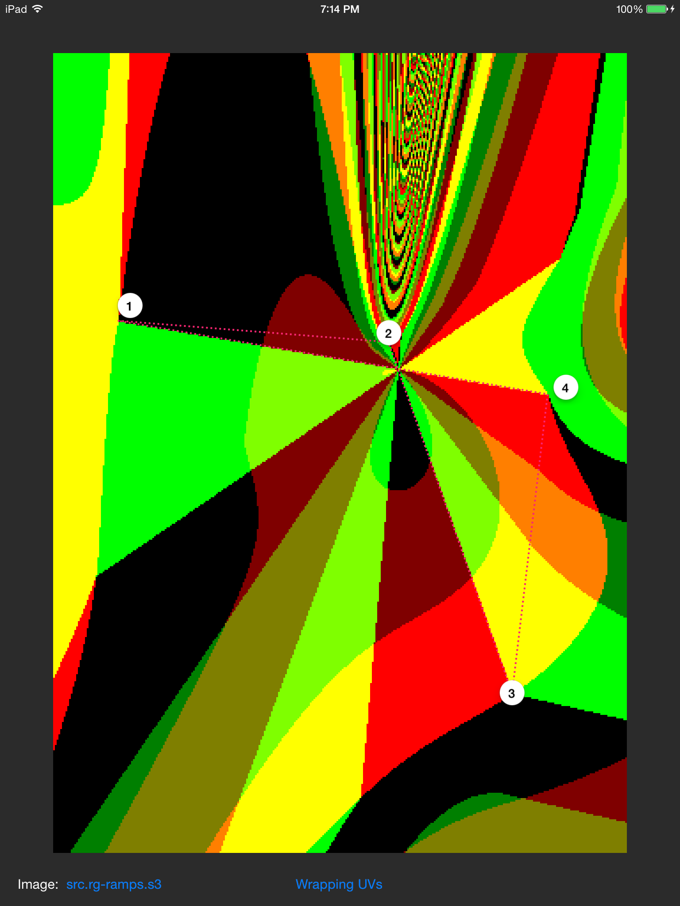

# CGDrawInQuad

**iOS test app for CPU-side CoreGraphics UV texture mapping into a quad.**

## Why?

Just kicking around some algorithms here before integration with the main game project _(which-shall-not-be-named \*ooh\* \*mysterious\*)_.

## Open Source?

Um, not truly open source licensed.  But no stated copyright and not really closed-source either.

I guess at this point, **Too-Trivial-and-Derived-From-Other-Resources-To-Care Source**.
